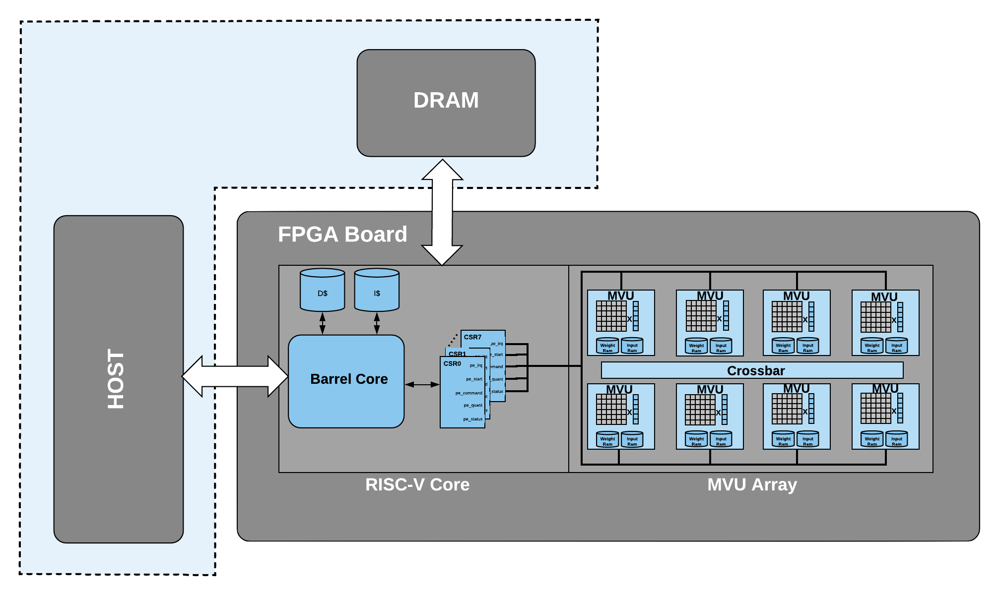
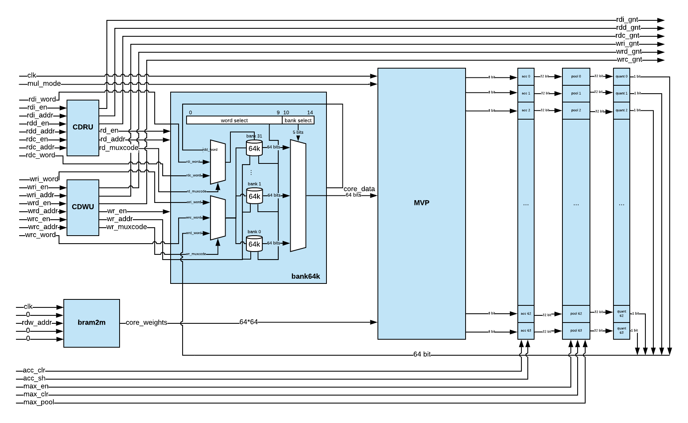
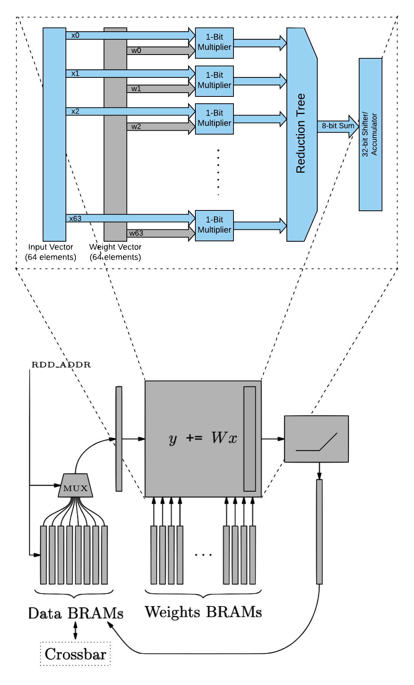
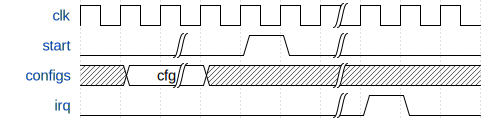
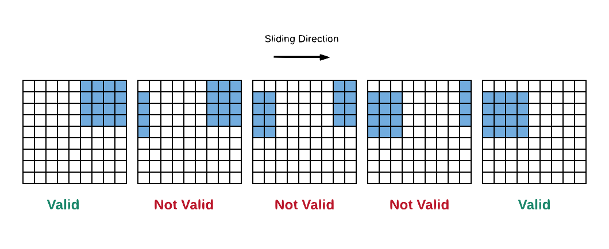
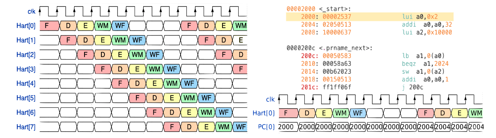
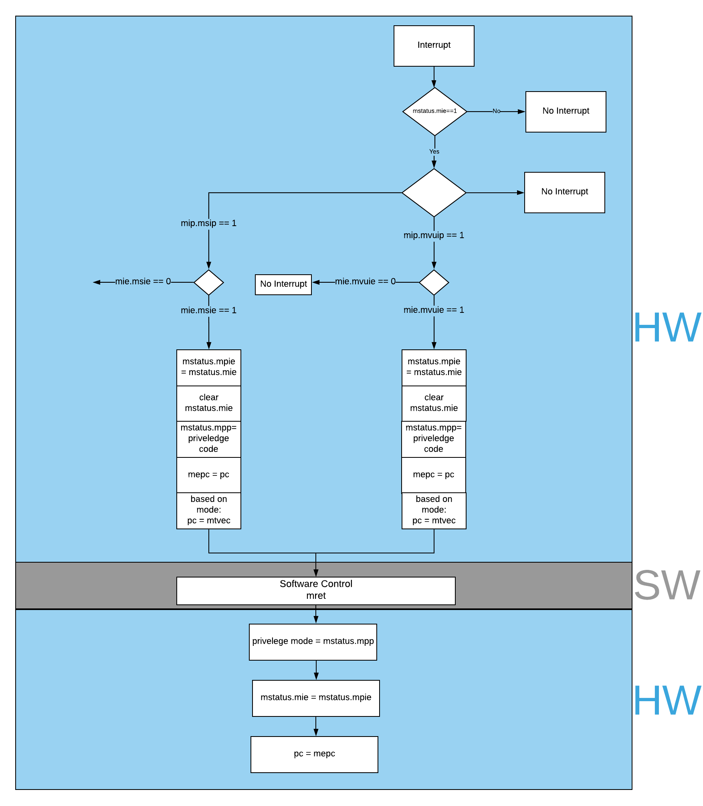

Design
============

BARVINN
-----------------
BARVINN is a Barrel RISC-V Neural Network Accelerator. The main purpose of designing BARVINN is to fill the need for arbitrary precision neural network acceleration. The overall architecture of BARVINN is illustrated below.
BARVINN is implemented in an FPGA. :numref:`fig_barvinn_top` illustrates the overall system design for BARVINN. It is consist of the following components:

- Array of Matrix Vector Units
- RISC-V Controller Core
- Host Machine

  BARVINN overall architecture.

In the following sections, we will review each part in details. 

Matrix Vector Unit (MVU) Array
------------------------------

In the base configuration, BARVINN uses 8 MVUs. At every clock cycle, each MVU is capable of performing a binary matrix-vector product of the following size:

- Input Vector of 1 x 64 with 1 bit precision
- Weight Matrix of 64 x 64 with 1 bit precision

Each MVU has a local memory to store activation and weights. The MVUs are connected through a crossbar. The crossbar allows MVUs to send part of their local memory (activations) among themselves. This allows MVUs to work on different jobs with different configurations or to work together to compute a single task. 

  This figure illustrates an MVU block diagram.

:numref:`mvu_arch` illustrates the block diagram of an MVU. Each MVU is consist of a Matrix Vector Product unit (MVP), Collision Detection Read Unit (CDRU), Collision Detection Write Unit (CDWU), activation RAM, weight RAM and a set of machine learning specific blocks such as quantizers, scaler units and pooling unit that can be switched on or off (technically, data will pass through all of these blocks and the user should provide proper configuration to bypass the functionality. For instance for `scaler` unit, if there is no need to scale the output, the user should write `1s` in scaler RAMs) depending on the job configuration. As it can be seen in :numref:`mvu_arch`, at each clock cycle, an MVU word (64 bits) is read from the activation RAM. At the same time, a long word of 4096 bits (64 by 64 ) is read from weight RAM. This is then fed into MVP unit which can perform one binary matrix-vector product each clock cycle. Depending on the precision configuration register (take a look at MVU_CSR_REG_TABLE_ for detailed register configuration for each MVU), multiple words will be read from weight and data memory to perform bit-serial multiplication.

:numref:`mvu_bit_slice` illustrates bit-serial operation in MVU. As it can be seen, an MVU data word of size 64 bit is read from data RAM. This will be fed into 64 bit-serial multiplication blocks. Each of these blocks performs a dot product between the two vectors. :numref:`mvu_bit_slice` shows only one bit-slice operation in the MVU, however, in reality, there are 64 modules that perform the same task on input data but with different weight vectors. For more information on MVU bit-serial operation, please refer to "Bit-Slicing FPGA Accelerator for Quantized Neural Networks" by O. Bilaniu et al.

  Bit serial operation in MVU.

As we mentioned before, the MVU is capable of performing computation with different bit precision. The way we achieve this task is by storing values in MSB transposed format in memory. This format of saving data in memory allows MVU to read-only as many words as the operand precision specifies. Since all the computations are happening in this format, the user should not worry about memory layout except when it wants to read results or write inputs (such as input image) into MVU RAMs. To solve this issue, there is a data transposer module that transposes the data to the correct format. Data transposer's job is to write input data (that is stored in a processor RAM in linear format) into MVU RAM in a transposed format. The input word can be packed with 2, 4, 8 or 16 bits of data. Given the input data precision (prec) the transposer will unpack, transpose and store them in the correct format. Once the MVU word is prepared, data tranposer will go into `BUSY` state in which it will ignore any incoming new input  data. At this point, the transposed data will be written into MVU word. Once complete, it will go back into `IDLE` state and it will wait for a new posedge on start signal to start the process all over again.
 

  Data transposer modlue, this module will pack vectors of size `XLEN` in MSB first transposed format.

MVU Job Configuration
^^^^^^^^^^^^^^^^^^^^^^^
MVUs are programmed to perform a single job. A job is started by the controller by raising the `start` signal. Once the job is finished, the MVU will generate an interrupt, informing the controller that the requested job is finished and the results are ready to be sent back to the host or to other MVUs. Once MVU is busy with a job, the `busy` signal is raised. During this time, MVU can be programmed for the next job and raising the `start` signal will not initiate any new job. 

  Timing diagram for configuring an MVU job.

:numref:`mvu_job_config` shows the timing diagram for sending a job to MVU. For sake of breavity, all config parameters are represented by `configs` signal. In the following sections, we will review what parameters can be set in the MVU.

Feature map memory access
^^^^^^^^^^^^^^^^^^^^^^^^^^^

:numref:`input_feature_map_mem_layouts` illustrates the memory layout for feature maps. MVU expects a NHWC layout for feature map features. Each element should be stored in a MSB transposed format. :numref:`input_feature_map_mem_layouts` shows that each word is 64 bit. As a result, accessing memory at location `0` will return a 64-bit word, where each bit, belongs to the MSB bit of the first 64 channels of the feature map. Elements of these 64 channels are concatenated (in MSB transposed format) together to form a channel block. The next memory address i.e `1` will return the `MSB-1` bits of the first 64 channels. This pattern continues until we reach the configured input precision i.e. `iprecision`. 

.. figure:: _static/input_feature_map_mem_layouts.png
  :width: 800
  :alt: Alternative text
  :name: input_feature_map_mem_layouts

  Input feature map memory layout.

Elements of each channel are written into feature map memory with an offset of `iprecision`. In case there are more than 64 channels in the feature map, we will store the first 64 channels in the first block, the second 64 channels into the second block and so on. As an example, an input tensor of `[N=1, H=8, W=8, C=256]` with 2-bit precision, will have 4 channel blocks, each block will have 64 rows of 2 by 64-bit elements. 

Weight Memory Access
^^^^^^^^^^^^^^^^^^^^^^

Weight memory layout is very similar to feature map memory layout. :numref:`weight_mem_layouts` illustrates the weight memory layout. Same as :numref:`input_feature_map_mem_layouts`, MVU expects a NHWC layout for weight tensor. However, in weight memory, we have input and output channels. By default, weight memory words are 4096 bit long. Allowing to concatenate a single MSB bit of `64x64` channels per row of weight memory. In deep neural network models, weight tensors are usually consist of a set of filters. The weight memory layout in MVU allows concatenating 64 input channels into 64 set of filters i.e. output channels. Like feature map memory layout, in case we have more than 64 input channels, we will write them into the next input channel blocks. Instead of `iprecision`, here we use `wprecision` to specify how many bits are required to represent any weight element.

.. figure:: _static/weight_mem_layouts.png
  :width: 800 
  :alt: Alternative text 
  :name: weight_mem_layouts 

  Weight memory layout. 

Like feature map memory layout, channel blocks are grouped together to form width columns and then height rows. Finally, we can group multiple height rows together to form output channels i.e. filters.

.. _Jump Schedules:

Jump Schedules
^^^^^^^^^^^^^^^^^^^^^^^^^^^^^
The memory layout described in previous sections allows MVU to efficiently compute matrix multiplication between input vectors and the weight matrices. However, a convolutional neural network, many matrix multiplies should be performed. One of the most common ways to perform convolution is to slide the weight tensor over input. :numref:`slide_window_valid` illustrates this operation. 

  Sliding window operation to perform Convolution. 

As you can see in :numref:`slide_window_valid`, if we just slide the weight tensor over input, not all dot products are valid. Luckily, for a given stride, padding and weight shape, we can pre-compute the pattern of memory accesses by the MVU to compute an operation such as GEMV or convolution. Each MVU includes address generators that can be programmed to implement a series of nested loops that can be used to move across the input data and weight tensors. Address generators have a set of `length` parameters that set the bounds of each nested loop, and a set of associated address `jump` (`jX`) parameters that are used to compute the next memory address to move to in a given loop. This is illustrated in the following pseudocode:

.. code-block:: C

  while (1) {
    for (i1 = length1; i1 > 0; i1--) 
    {
      for (i2 = length2; i2 > 0; i2--) 
      {
        for (i3 = length3; i3 > 0; i3--) 
        {
          for (i4 = length4; i4 > 0; i4--) 
          {    
            addr_out += j4;
          }
          addr_out += j3;
        }
        addr_out += j2;
      }
      addr_out += j1;
    }
    addr_out += j0;
  }

For a 2D convolution operation, :numref:`feature_map_jump_schedule` and :numref:`weight_jump_schedule` illustrates what each jump configuration is:

.. figure:: _static/feature_map_jump_schedule.png
  :width: 800
  :alt: Alternative text
  :name: feature_map_jump_schedule

  Input feature jump schedule.

For inputs we have the following configurable `jump` variables:

- `j3`: jump over precision length for input data (i.e. set to `iprec`).
- `j2`: Specifies if we have reached window width, if so, move to the next row in the window.
- `j1`: Specifies if we have reached window height and width, if so, move back to window start for next precision combo or next filter set (i.e. for same output (x,y), start computing next output channel block).
- `j0`: Specifies if we have finished all filter sets in the window and done output (x,y). Slide window by horizontal stride. Start output (x+1, y). Note that the diagram shows a horizontal stride of 1.
- `j4`: not applicable.

.. figure:: _static/weight_jump_schedule.png
  :width: 800
  :alt: Alternative text
  :name: weight_jump_schedule

  Weight jump schedule.

- `j3`: jump over precison length for weights (i.e. set to `wprecision`).
- `j2`: Specifies if we have reached window width and height, if so, move back to filter start for next precision combo.
- `j1`: Specifies if we have finished all bit combos for the current filter set and channel block for output (x,y) and if so, move to the next filter set and compute the next channel block for output (x,y).
- `j0`: Specifies if we have finished all filter sets and channel blocks for output (x,y) and if so, move back to the start of the first filter set for the next window and output (x+1, y).
- `j4`: not applicable.

In general, each MVU has 44 configurable registers that can be used in the software. Section :ref:`Control Status Registers` provides details of each register. 

PITO: A Barrel RISC-V Processor
------------------------------------
To make use of MVUs for neural networks, some form of the control unit is required. It is not possible to foresee and provide for all possible neural networks that may crop up in the literature in the future. Therefore, the high-level sequencing of tensor operations should be provided for in software, possibly assisted by `glue` logic to help drive the MVUs’ control signals. 

PITO is a Barrel RISC-V processor, designed to control the 8 MVUs in `Bilaniuk et al. (2019)` using separate but communicating hardware threads (harts) that each manages their respective MVUs. Neural network layers can then be executed either in parallel or in a pipelined fashion depending on whether the neural network software is compiled to maximize throughput or minimize latency. This design also allows MVUs to complete tensor operations independently of each other. However, the drawback is that, at least nominally, this requires 8 microprocessors to execute the 8 programs, putting serious pressure on the remaining logic of the host FPGA. We instead amortized the fixed costs of the processor by adopting an old idea: `the barrel processor`. By making the barrel processor 8-way threaded, we may assign one thread to control each of the MVUs, while amortizing the fixed costs of each microprocessor over the 8 threads. Because every thread comes up for execution only every 8 clock cycles, up to 8 pipeline stages including instruction fetch, decode, execution and data read & writes can be completely hidden. Branch prediction units are also made unnecessary. Because even modest tensor operations can require hundreds of matrix-vector products (and therefore clock cycles) to execute on an MVU, the barrel processor has the opportunity to fully turn over dozens of times in the interim, allowing each thread to issue the next command to its MVU in a few instructions.

A barrel processor is a form of a fine-grain multithreading processor that exploits thread-level parallelism by switching between different threads on each clock cycle (Hennessey and Patterson,2011). The aim is to maximize the overall utilization of the processor’s resources, and instruction throughput. This is similar to the technique of simultaneous multi-threading (SMT) that is used in modern superscalar processors. However, unlike SMT superscalar processors, barrel processors do not issue more than one instruction per clock cycle. Instead, a single execution pipeline is shared by all threads. :numref:`pito_barreled` illustrates the data path of `PITO`, a 5 stage 8 hart, barrel processor compatible with RV32I RISC-V ISA.

.. figure:: _static/pito_barreled.png
  :width: 800
  :alt: Alternative text
  :name: pito_barreled

  PITO Datapath, a 5 stage 8 hart, barrel processor. 

We adopted a Harvard architecture and divided the instruction and data cache. In our design, we used 32KB BRAM for each cache. This gives a 1K word space to store data and instructions to control each MVU. The processor is an in-order CPU and instructions are executed following compilation order and without any further scheduling. However, a hart scheduler is needed to give access to the required resources for the hart at each stage. In the fetch stage, each hart needs to fetch instructions from the instruction cache. As explained earlier, we used 32KB of instruction cache which is shared between all harts. However, the program counter (PC) for each hart is different. To keep track of this, we used 8 registers for PCs and the hart scheduler indicates which register should be accessed at any given time. In the Decode stage, the fetched instruction needs to be decoded, and source registers (rs1 and rs2) or an immediate (imm) operand needs to be loaded. Each hart has its own register file and in the Decode stage, the hart scheduler gives access to the scheduled hart’s register file.

  This figure shows 8 harts running in the barrel processor that has 5-stage pipeline. The figure on the right shows every 8 clock cycles, the program counter of the associated hart increments, which allows this pipeline to be implemented without any data or control hazard circuitry.

The hart scheduler itself uses a strict round-robin algorithm. No preemption or priority is implemented and every hart is given a fixed amount of time slots for execution. Figure 4.3a shows how harts are scheduled for execution in our design. Considering the execution for Hart[0], it takes 5 clock cycles for an instruction to be completed. After the 5th clock tick, no more processing associated with Hart[0] is performed. The next three slots are given to Hart[5], Hart[6] and Hart[7]. Thus each hart executes an instruction every 8th cycle of the main clock. Hence the CPI of 8. From the perspective of the main CPU, the throughput is one instruction per clock cycle. From the perspective of each hart, we are running at an 8th of the main clock speed with a CPI of 1.

PITO is compatible with RV32I RISC-V ISA. In fact, PITO passes all the RISC-V tests, confirming that it is compliant with the RV32I ISA. In addition to base CSRs (refer to :ref:`RV32_CSR_REG_TABLE` for details) and to specialize PITO for our accelerator, we have added 44 MVU specific CSRs. In Section :ref:`examples`, we have provided example codes to program these CSRs to submit a job to MVU. 

Interrupts
^^^^^^^^^^^^^

In BARVINN, MVUs can send interrupts to their associated hart. These interrupts are added to RISC-V custom interrupts `mie` field. To reduce complexity, there are no supports for nested interrupts or interrupt priorities. However, we followed RISC-V's interrupt operation flow. :numref:`pito_irq` illustrates servicing interrupt flow in software and hardware.

  Interrupt service routine in hardware and software 

.. _RV32_CSR_REG_TABLE:

Control Status Registers (RISC-V)
^^^^^^^^^^^^^^^^^^^^^^^^^^^^^^^^^^

+------+---------------+-----------------------+-----------------------------------------------------------------+
| ADRR | CSR           | RO/RW                 | Description                                                     |
+======+===============+=======================+=================================================================+
|0x301 | misa          | RO                    | A constant, but MSB = 0 for open-source implementation..        |
+------+---------------+-----------------------+-----------------------------------------------------------------+
|0xF11 | mvendorid     | RO/Zero               | Identification. Can be zero.                                    |
+------+---------------+-----------------------+-----------------------------------------------------------------+
|0xF12 | marchid       | RO/Zero               | Identification. Can be zero.                                    |
+------+---------------+-----------------------+-----------------------------------------------------------------+
|0xF13 | mimpid        | RO/Zero               | Identification. Can be zero.                                    |
+------+---------------+-----------------------+-----------------------------------------------------------------+
|0xF14 | mhartid       | RO, cycle counter % 8 | Shared with cycle counter.                                      |
+------+---------------+-----------------------+-----------------------------------------------------------------+
|0x300 | mstatus       | RW,                   | Critically-important bits like Global Interrupt Enables         |
|      |               | per-thread            |                                                                 |
+------+---------------+-----------------------+-----------------------------------------------------------------+
|0x305 | mtvec         | RO or RW if wanted    | Interrupt vector, or interrupt vector table base address.       |
|      |               |                       | Register is RW if we want to be able to choose between these    |
|      |               |                       | two modes, or change the address.                               |
+------+---------------+-----------------------+-----------------------------------------------------------------+
|0x344 | mip           | RO,                   | Pending interrupts bitfield                                     |
|      |               | per-thread            |                                                                 |
+------+---------------+-----------------------+-----------------------------------------------------------------+
|0x304 | mie           | RW,                   | Enabled interrupts bitfield                                     |
|      |               | per-thread            |                                                                 |
+------+---------------+-----------------------+-----------------------------------------------------------------+
|0xB00 | mcycle        | RW                    | Cycles counter, low 32 bits                                     |
|      |               | per-thread            |                                                                 |
+------+---------------+-----------------------+-----------------------------------------------------------------+
|0xB80 | mcycleh       | RW                    | Cycles counter, high 32 bits                                    |
|      |               | per-thread            |                                                                 |
+------+---------------+-----------------------+-----------------------------------------------------------------+
|0xB02 | minstret      | RW                    | Instructions retired counter, low 32 bits                       |
|      |               | per-thread            |                                                                 |
+------+---------------+-----------------------+-----------------------------------------------------------------+
|0xB82 | minstreth     | RW                    | Instructions retired counter, high 32 bits                      |
|      |               | per-thread            |                                                                 |
+------+---------------+-----------------------+-----------------------------------------------------------------+
|0xxxx | mhpm*         | RO/Zero               | High-performance counter control registers, not supported       |
+------+---------------+-----------------------+-----------------------------------------------------------------+
|0xxxx | mcountinhibit | RO/Zero               | High-performance counter inhibit, not supported                 |
+------+---------------+-----------------------+-----------------------------------------------------------------+
|0x340 | mscratch      | RW,                   | Scratch register, necessary to support interrupts               |
|      |               | per-thread            |                                                                 |
+------+---------------+-----------------------+-----------------------------------------------------------------+
|0x341 | mepc          | RW,                   | Exception program counter                                       |
|      |               | per-thread            |                                                                 |
+------+---------------+-----------------------+-----------------------------------------------------------------+
|0x342 | mcause        | RW,                   | Interrupt cause                                                 |
|      |               | per-thread            |                                                                 |
+------+---------------+-----------------------+-----------------------------------------------------------------+
|0x343 | mtval         | RW,                   | Stores either faulting address, or contains illegal instruction |
|      |               | per-thread            |                                                                 |
+------+---------------+-----------------------+-----------------------------------------------------------------+

.. _Control Status Registers:

Control Status Registers (MVU)
^^^^^^^^^^^^^^^^^^^^^^^^^^^^^^^^^^

.. _MVU_CSR_REG_TABLE:

+-----------------+-------+-------------------------------------------------------------+
| CSR             | RO/RW | Description                                                 |
+=================+=======+=============================================================+
| mvuwbaseptr     | RW    | Base address for weight memory                              |
+-----------------+-------+-------------------------------------------------------------+
| mvuibaseptr     | RW    | Base address for input memory                               |
+-----------------+-------+-------------------------------------------------------------+
| mvusbaseptr     | RW    | Base address for scaler memory (6-bit)                      |
+-----------------+-------+-------------------------------------------------------------+
| mvubbaseptr     | RW    | Base address for bias memory (6-bit)                        |
+-----------------+-------+-------------------------------------------------------------+
| mvuobaseptr     | RW    | Output base address:                                        |
|                 |       +-------------------------------------------------------------+
|                 |       | 0-23: address                                               |
|                 |       +-------------------------------------------------------------+
|                 |       | 31-24: destination MVUs (bit 24 -> MVU 0)                   |
+-----------------+-------+-------------------------------------------------------------+
| mvuwjump[0-4]   | RW    | Weight address jumps in loops 0-4                           |
+-----------------+-------+-------------------------------------------------------------+
| mvuijump[0-4]   | RW    | Input data address jumps in loops 0-4                       |
+-----------------+-------+-------------------------------------------------------------+
| mvusjump[0-1]   | RW    | Scaler memory address jumps (6-bit)                         |
+-----------------+-------+-------------------------------------------------------------+
| mvubjump[0-1]   | RW    | Bias memory address jumps (6-bit)                           |
+-----------------+-------+-------------------------------------------------------------+
| mvuojump[0-4]   | RW    | Output data address jumps in loops 0-4                      |
+-----------------+-------+-------------------------------------------------------------+
| mvuwlength[1-4] | RW    | Weight length in loops 1-4                                  |
+-----------------+-------+-------------------------------------------------------------+
| mvuilength[1-4] | RW    | Input data length in loops 1-4                              |
+-----------------+-------+-------------------------------------------------------------+
| mvuslength[1]   | RW    | Scaler tensor lengths(15-bit)                               |
+-----------------+-------+-------------------------------------------------------------+
| mvublength[1]   | RW    | Bias tensor lengths (15-bit)                                |
+-----------------+-------+-------------------------------------------------------------+
| mvuolength[1-4] | RW    | Output data length in loops 1-4                             |
+-----------------+-------+-------------------------------------------------------------+
| mvuprecision    | RW    | Precision in bits for all tensors:                          |
|                 |       +-------------------------------------------------------------+
|                 |       | 0-5: weights precision                                      |
|                 |       +-------------------------------------------------------------+
|                 |       | 6-11: input data precision                                  |
|                 |       +-------------------------------------------------------------+
|                 |       | 12-17: output data precision                                |
|                 |       +-------------------------------------------------------------+
|                 |       | 24: weights signed (0: unsigned, 1: signed)                 |
|                 |       +-------------------------------------------------------------+
|                 |       | 25: input data signed (0: unsigned, 1: signed)              |
+-----------------+-------+-------------------------------------------------------------+
| mvustatus       | RO    | Status of MVU:                                              |
|                 |       +-------------------------------------------------------------+
|                 |       | 0: busy                                                     |
|                 |       +-------------------------------------------------------------+
|                 |       | 1: done                                                     |
+-----------------+-------+-------------------------------------------------------------+
| mvucommand      | RW    | Kick to send command:                                       |
|                 |       +-------------------------------------------------------------+
|                 |       | 30-31: MulMode (00:{0,0} 01:{0,+1} 10:{-1,+1} 11:{0, -1})   |
|                 |       +-------------------------------------------------------------+
|                 |       | 29: MaxPool enable                                          |
|                 |       +-------------------------------------------------------------+
|                 |       | 0-28: Clock cycle countdown                                 |
+-----------------+-------+-------------------------------------------------------------+
| mvuquant        | RW    | MVU Quantization Configs:                                   |
|                 |       +-------------------------------------------------------------+
|                 |       | 6-11: MSB index position                                    |
|                 |       +-------------------------------------------------------------+
|                 |       | 12-31: reserved (possibly for activation params)            |
+-----------------+-------+-------------------------------------------------------------+
| mvuscaler       | RW    | 0-15: fixed point operand for multiplicative scaling        |
+-----------------+-------+-------------------------------------------------------------+
| mvuconfig1      | RW    | MVU General Configurations                                  |
|                 |       +-------------------------------------------------------------+
|                 |       | 0-7: Shift/accumulator load on jump select (only 0-4 valid) |
|                 |       +-------------------------------------------------------------+
|                 |       | 8-16: Pool/Activation clear on jump select (only 0-4 valid) |
+-----------------+-------+-------------------------------------------------------------+

mvuwbaseptr
^^^^^^^^^^^^^^^^^^^^^^^^^^^^^^^^^^

mvuibaseptr
^^^^^^^^^^^^^^^^^^^^^^^^^^^^^^^^^^

mvusbaseptr
^^^^^^^^^^^^^^^^^^^^^^^^^^^^^^^^^^

mvubbaseptr
^^^^^^^^^^^^^^^^^^^^^^^^^^^^^^^^^^

mvuobaseptr
^^^^^^^^^^^^^^^^^^^^^^^^^^^^^^^^^^
`mvuobaseptr` output address, results of each operation will be written into this address.
Destination MVU, results can be sent to other MVUs by setting the appropriate MVU (0 to7 ) field. The result can be broadcasted to any number of MVUs in the system.

mvuwjump
^^^^^^^^^^^^^^^^^^^^^^^^^^^^^^^^^^
`mvuwjump` is the weight address jumps in loops 0-4. Hence, there are 5 registers all start with `mvuwjump_` but then to access a specific loop, you need to append the loop number at the end (refer to :ref:`Jump Schedules` section for details on loop count). For instance, for `loop1` one can use `mvuwjump_1`.

mvuijump
^^^^^^^^^^^^^^^^^^^^^^^^^^^^^^^^^^
Same as `mvuwjump`, there are 5 loops that can be used to address input data. These loops can be accessed as `mvuijump_0` to `mvuijump_4`.

.. figure:: _static/wavedrom/mvuijump.svg
  :width: 800
  :alt: Alternative text

mvusjump
^^^^^^^^^^^^^^^^^^^^^^^^^^^^^^^^^^
For scaler memory, we have only two jumps and they can be accessed as `mvusjump_0` and `mvusjump_1`.

mvubjump
^^^^^^^^^^^^^^^^^^^^^^^^^^^^^^^^^^
For bias memory, we have only two jumps and they can be accessed as `mvubjump_0` and `mvubjump_1`.

mvuojump
^^^^^^^^^^^^^^^^^^^^^^^^^^^^^^^^^^
Same as `mvuwjump`, there are 5 loops that can be used to address output memory. These loops can be accessed as `mvuojump_0` to `mvuojump_4`.

mvuwlength
^^^^^^^^^^^^^^^^^^^^^^^^^^^^^^^^^^
There are 4 registers to specify weight length loops and can be accessed as `mvuwlength_1` to `mvuwlength_4`. Note, `mvuwlength_0` is intentionally not used.

mvuilength
^^^^^^^^^^^^^^^^^^^^^^^^^^^^^^^^^^
There are 4 registers to specify input data length loops and can be accessed as `mvuilength_1` to `mvuilength_4`.  Note, `mvuilength_0` is intentionally not used.

mvuslength
^^^^^^^^^^^^^^^^^^^^^^^^^^^^^^^^^^
There is only one register to specify scaler tensor length and it can be accessed as `mvuslength_1`.  Note, `mvuslength_0` is intentionally not used.

mvublength
^^^^^^^^^^^^^^^^^^^^^^^^^^^^^^^^^^
There is only one register to specify scaler tensor length and it can be accessed as `mvublength_1`.  Note, `mvublength_0` is intentionally not used.

mvuolength
^^^^^^^^^^^^^^^^^^^^^^^^^^^^^^^^^^
There are 4 registers to specify input data length loops and can be accessed as `mvuolength_1` to `mvuolength_4`.  Note, `mvuolength_0` is intentionally not used.

mvuprecision
^^^^^^^^^^^^^^^^^^^^^^^^^^^^^^^^^^
`weight precision`, `input precision` and `output precision` indicates the computation precision accordingly. `isign` and `wsign` can be used to set if the data is signed `1` or not `0`.

mvustatus
^^^^^^^^^^^^^^^^^^^^^^^^^^^^^^^^^^
Specifies MVU status which is either `busy` (0) or `done` (1).

mvucommand
^^^^^^^^^^^^^^^^^^^^^^^^^^^^^^^^^^
Setting any value to this register will send a kick start signal to MVU to start the configured job. The register fields are described in :ref:`Control Status Registers`.

mvuquant
^^^^^^^^^^^^^^^^^^^^^^^^^^^^^^^^^^
In the case we need to quantize results, `msbidx` can be used. This field indicates that where does the `msb` position start.

mvuscaler
^^^^^^^^^^^^^^^^^^^^^^^^^^^^^^^^^^
A fixed point multiplier value that can be used to rescale a quantized value. 

mvuconfig1
^^^^^^^^^^^^^^^^^^^^^^^^^^^^^^^^^^

