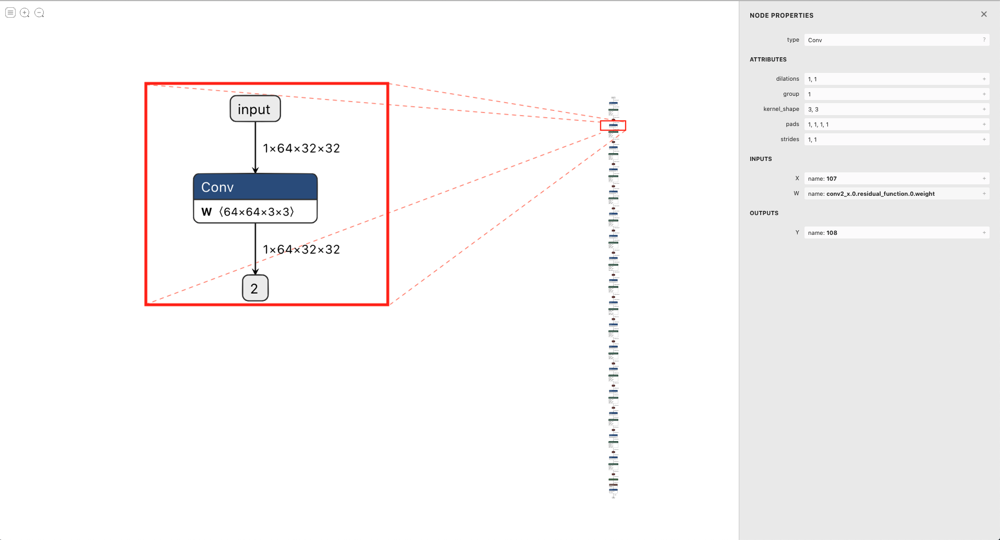

.. _examples:

Examples
============

Environment Setup
-----------------------

To run a neural network model using BARVINN, you will need to use 4 different repositories:

- `BARVINN <https://github.com/hossein1387/Accelerator>`_. : The top module repo that re-uses pito and MVU project.
- `PITO_RISCV <https://github.com/hossein1387/pito_riscv>`_. : The barrel RISC-V processor.
- `MVU <https://github.com/obilaniu/MVU>`_. : The Matrix Vector Unit accelerator.
- `MVU_Code_Gen <https://github.com/hossein1387/MVU_Code_Gen>`_. : A repository that contains python libraries to generate configuration code for MVU.

We have added the last three repositories as a gitmodule to BARVINN repository. Hence, you only need to clone BARVINN repository as below:

.. code:: bash

  git clone https://github.com/hossein1387/BARVINN
  cd BARVINN
  git submodule update --init --recursive

As mentioned earlier, BARVINN requires RISC-V GCC that supports RV32I. You can either install RISC-V GCC with your favorite OS package manager, or you can follow `picorv32 <https://github.com/cliffordwolf/picorv32#building-a-pure-rv32i-toolchain>`_. project to build a pure RV32I toolchain. The following are some of the examples that you can run on BARVINN.

Matrix Multiplication
-----------------------

In this example code, we want to program `MVU[0]` to perform a matrix multiplication. Note that we do not include code for transferring data into MVU's feature map and weight memory. Here we are simply assuming that the data is in the correct format and layout. The following code performs a matrix multiplication between input feature map vector of size `[1x1x1x64]` at 2-bit precision with a weight matrix of size `[1x64x64x16]` at 2-bit precision. The output result is written to `0x400` with 2-bit precision. As we mentioned in the `design` section, the controller (`pito`) configures a job by setting the appropriate CSR registers and then kick starts the job by writing into `mvucommand` CSR register. Although one can monitor the job status by polling the `mvustatus` register, MVU will send an interrupt once the job is done and ready to be read. In the following code block, we first enable global and MVU specific irq (in `enable_mvu_irq` function). We then set the address for the MVU irq handler to service the interrupt (in `__startup_code__`). We then program a matrix multiply job in `mat_mul` function. At this point, we can start to prepare and configure the next job, or we can just wait for an interrupt. For this simple example, we wait for an interrupt from `MVU`. Finally, if everything works as expected, we should see `OK\n` in register `a1`, `a2` and `a3` and in memory address `0x10000000`.

.. code:: c

  #include "pito_def.h"

  jal sp, enable_mvu_irq
  jal sp, __startup_code__
  jal sp, mat_mul
  jal t3, wait_for_mvu_irq
  jal sp, prog_end

  // in startup code, we need to set the following:
  //   -> mtvec addresses
  //
  __startup_code__:
      // addi x1, x0, pito_mtvec_mask
      // creating mtvec mask
      lui  a0, %hi(mvu_irq_handler)
      addi a0, a0, %lo(mvu_irq_handler )
      csrw mtvec, a0
      addi ra, sp, 0
      ret

  wait_for_mvu_irq:
      csrr t0, mcause
      srli t0, t0, 31
      addi t1, x0, 1
      // wait for mcause[31] interrupt to go high
      bne t0, t1, wait_for_mvu_irq
      addi ra, t3, 0
      ret

  mvu_irq_handler:
      // make sure global interrupt is disabled
      csrwi mstatus, 0x0
      // first things first, clear mvu intterupts pending bit while processing current irq.
      addi x1, x0, 1
      slli x1, x1, 16
      csrc mip, x1
      // do whatever to make MVU happy 
      addi x0, x0, 0
      // we can now start processing incoming interrupts
      addi gp, sp, 0
      jal sp, enable_mvu_irq
      addi ra, gp, 0
      mret

  enable_mvu_irq:
      // make sure global interrupt is enabled
      csrwi mstatus, 0x8
      // set MVU specific MIE bit aka mie[16]
      addi t0, x0, 1
      slli t0, t0, 16
      csrw mie, t0
      addi ra, sp, 0
      ret

  disable_mvu_irq:
      // clear MVU specific MIE bit
      addi t0, x0, 1
      slli t0, t0, 16
      not t0, t0
      csrw mie, t0
      addi ra, sp, 0
      ret

  clear_mvu_pending_irq:
      csrrci x0, mip, 0
      ret

  mat_mul:
      addi  x1, x0, 0
      addi  x2, x0, 2
      add   x1, x1, x2               // set weight precision to 2
      slli  x3, x2, 6                // set input precision to 2
      add   x1, x1, x3
      slli  x3, x2, 12                // set output precision to 2
      add   x1, x1, x3
      csrw  mvu_precision,  x1

      csrwi mvu_quant     , 10       // set quant_msbidx to 10
      csrwi mvu_wbaseaddr , 0        // set weight address to 0
      csrwi mvu_ibaseaddr , 0        // set input address to 0

      addi  x1, x0, 1
      slli  x1, x1, 10               // set output address to 0x400
      csrw mvu_obaseaddr , x1

      csrwi mvu_wstride_0 , 30       // 1 tile back move x 2 bits
      csrwi mvu_wstride_1 ,  2       // 1 tile ahead move x 2 bits
      csrwi mvu_wstride_2 ,  0 
      csrwi mvu_wstride_3 ,  0
      csrwi mvu_istride_0 , 30       // 1 tile back move x 2 bits 
      csrwi mvu_istride_1 ,  0 
      csrwi mvu_istride_2 ,  0 
      csrwi mvu_istride_3 , 30 
      csrwi mvu_ostride_0 ,  0 
      csrwi mvu_ostride_1 ,  0 
      csrwi mvu_ostride_2 ,  0 
      csrwi mvu_ostride_3 ,  0 
      csrwi mvu_wlength_0 ,  1       // 2 tiles in width
      csrwi mvu_wlength_1 ,  3       // number bit combinations i.e. 2x2 bits
      csrwi mvu_wlength_2 ,  1       // 2 tiles in height
      csrwi mvu_wlength_3 ,  0
      csrwi mvu_ilength_0 ,  1       // 2 tiles in height
      csrwi mvu_ilength_1 ,  0       // number bit combinations
      csrwi mvu_ilength_2 ,  0       // 2 tiles in width of matrix operand
      csrwi mvu_ilength_3 ,  0       
      csrwi mvu_olength_0 ,  1 
      csrwi mvu_olength_1 ,  0 
      csrwi mvu_olength_2 ,  0 
      csrwi mvu_olength_3 ,  0 

      addi x1, x0, 1
      slli x1, x1, 30                // mul mode 01
      addi x1, x1, 16
      csrw mvu_command, x1           // Kick start MVU, 2 tiles x 2 tiles x 2bit x 2bits

      ret

  // Done with our awesome program!
  prog_end:
      lui a0,0x10000000>>12
      addi  a1,zero,'O'
      addi  a2,zero,'K'
      addi  a3,zero,'\n'
      sw  a1,0(a0)
      sw  a2,0(a0)
      sw  a3,0(a0)
      ebreak

To run the code on BARVINN, we will first need to compile the above code. This source code is provided in BARVINN's `csrc directory <https://github.com/hossein1387/Accelerator/tree/master/csrc>`_. You can compile the code using the following instructions:

.. code:: bash

  cd matmul
  make matmul.hex

This will generate a hex file that should be loaded into BARVINN. Now to run th program on BARVINN, you should follow these steps:

First make sure Vivado is in the PATH:

.. code:: bash

  source /opt/Xilinx/Vivado/2019.1/settings64.sh

Then, assuming FuseSoC is already instlled, if not done already, we need to let FuseSoC know where to find PITO and MVU repos:

.. code:: bash

  cd BARVINN/MVU
  fusesoc library add mvu .
  cd ..
  cd BARVINN/pito_riscv
  fusesoc library add pito .
  cd ..
  fusesoc library add barvinn .

The commands above need to be executed once so that FuseSoC registers the BARVINN, PITO and MVU project correctly. Now that FuseSoC is configured properly, we can run a FuseSoC target for BARVINN (assuming `matmul.hex` is in the current directory):

.. code:: bash

  cd ..
  fusesoc library add barvinn .
  fusesoc run --target=sim barvinn --firmware=matmul.hex

By default, we have set `verification/tests/core/core_tester.sv` to run. However, one can change this by modifying `barvinn core file <https://github.com/hossein1387/Accelerator/blob/fusesoc/barvinn.core>`_ . Also, you by default, there are initial simulation values in MVU's weight and input rams. You can modify that by using different input and weight files.

Convolution:
-----------------------
In this example code, we want to program `MVU[0]` to perform a Convolution operation. We will first start with an ONNX model. 
:numref:`resnet18_second_layer` shows that the second layer of `resnet18` on cifar100 performs a convolution with input size of `[1x64x32x32]` with a weight tensor of size `[64x64x3x3]`. The convolution parameters are illustrated by Netron in :numref:`resnet18_second_layer`. 

  Model used for Convolution example. This image shows that we are using the second conv layer of resnet18 on Cifar100. ONNX model is illustrated using Netron.

The model in ONNX format is not suitable for MVU. As we discussed in previous sections, we have written a code generator software to take an ONNX model and then provide the user with the proper MVU configuration settings. For this example, assuming we have saved this simple one layer convolution block as `SimpleConv.onnx`, we can use the code generator as below:

.. code:: python

    1 import logging
    2 import argparse
    3 from OnnxParser import OnnxParser
    4 from Generator import Generator
    5 import utils
    6 
    7 def parse_args():
    8     parser = argparse.ArgumentParser()
    9     parser.add_argument('-x', '--onnx_model', help='input onnx model', required=True)
   10     parser.add_argument('--aprec', help='Activation precision', required=False, default=8, type=int)
   11     parser.add_argument('--wprec', help='Weight precision', required=False, default=8, type=int)
   12     parser.add_argument('--oprec', help='Output precision', required=False, default=8, type=int)
   13     parser.add_argument('--input_shape', help='input shape for ',  nargs='*', required=False, default=[3,32,32], type=int)
   14     args = parser.parse_args()
   15     return vars(args)
   16 
   17 if __name__ == '__main__':
   18     args = parse_args()
   19     model_path = args['onnx_model']
   20     precision = [args['aprec'], args['wprec'], args['oprec']]
   21     input_shape = args['input_shape']
   22     model = OnnxParser(model_path)
   23 
   24     # model.print_onnx_graph()
   25     # model.print_onnx_model()
   26     if len(args['input_shape'])>3:
   27         print("Expecting an input array of shape: [channels, height, lenghth]")
   28         import sys
   29         sys.exit()
   30     generator = Generator(model, precision, input_shape)
   31     generator.generate_mvu_configs()
   32     generator.export_weigths()
   33     utils.gen_test_vecs(model_path, precision, input_shape)

And then execute the script above as below:

.. code:: bash

  python sample_mvu_code_generator.py -x SimpleConv.onnx  --aprec 8 --wprec 8 --oprec 8 --input_shape 64 32 32

In the command above, we are specifying a 2 bit precision for weights, activation and output result. We are also specifying the input shape of the model. Here is the output for the command above:

.. code:: bash

  Generated MVU configuration:
  +-------------+-----------+------------------+-------------------------+------------------+---------------------+-----------+-----------------------+
  | iShape      | fShape    | ilength          | ijump                   | wlength          | wjump               | countdown | total layer countdown |
  +-------------+-----------+------------------+-------------------------+------------------+---------------------+-----------+-----------------------+
  | [1, 32, 32] | [1, 3, 3] | [0, 63, 2, 2, 0] | [-528, -528, 240, 8, 0] | [0, 0, 63, 8, 0] | [-64, 8, -64, 8, 0] | 17280     | 587520                |
  +-------------+-----------+------------------+-------------------------+------------------+---------------------+-----------+-----------------------+
  Total countdown: 587520
  Exporting conv1.weight to conv1.weight.hex
  Inference finised in 0.0030 seconds
  Exporting output to output.hex
  Exporting input to input.hex

Here is what we generated after executing the command above:

- A Generated MVU configuration table.
- A weight hex file in MSB transposed format `conv1.weight.hex`
- An input hex file `input.hex`
- An output hex file `output.hex`

The generated MVU configurations can be used to write a program to configure MVU csrs. The weight hex file can be directly used in simulation using `$readmemh` to write into MVU weight rams. For verification and testing the correctness of our design, we run the model through `OnnxRuntime` engine to capture the execution time and output results. However, since `OnnxRuntime` supports only 8-bit operation, the MVU results might not be the same as `OnnxRuntime` so for now we use 8 bit precision on MVU. 

.. code:: c

  #include "pito_def.h"

  jal sp, enable_mvu_irq
  jal sp, __startup_code__
  jal sp, mat_mul
  jal t3, wait_for_mvu_irq
  jal sp, prog_end

  // in startup code, we need to set the following:
  //   -> mtvec addresses
  //
  __startup_code__:
      // addi x1, x0, pito_mtvec_mask
      // creating mtvec mask
      lui  a0, %hi(mvu_irq_handler)
      addi a0, a0, %lo(mvu_irq_handler )
      csrw mtvec, a0
      addi ra, sp, 0
      ret

  wait_for_mvu_irq:
      csrr t0, mcause
      srli t0, t0, 31
      addi t1, x0, 1
      // wait for mcause[31] interrupt to go high
      bne t0, t1, wait_for_mvu_irq
      addi ra, t3, 0
      ret

  mvu_irq_handler:
      // make sure global interrupt is disabled
      csrwi mstatus, 0x0
      // first things first, clear mvu intterupts pending bit while processing current irq.
      addi x1, x0, 1
      slli x1, x1, 16
      csrc mip, x1
      // do whatever to make MVU happy 
      addi x0, x0, 0
      // we can now start processing incoming interrupts
      addi gp, sp, 0
      jal sp, enable_mvu_irq
      addi ra, gp, 0
      mret

  enable_mvu_irq:
      // make sure global interrupt is enabled
      csrwi mstatus, 0x8
      // set MVU specific MIE bit aka mie[16]
      addi t0, x0, 1
      slli t0, t0, 16
      csrw mie, t0
      addi ra, sp, 0
      ret

  disable_mvu_irq:
      // clear MVU specific MIE bit
      addi t0, x0, 1
      slli t0, t0, 16
      not t0, t0
      csrw mie, t0
      addi ra, sp, 0
      ret

  clear_mvu_pending_irq:
      csrrci x0, mip, 0
      ret

  mat_mul:
      addi  x1, x0, 0
      addi  x2, x0, 2
      add   x1, x1, x2               // set weight precision to 2
      slli  x3, x2, 6                // set input precision to 2
      add   x1, x1, x3
      slli  x3, x2, 12                // set output precision to 2
      add   x1, x1, x3
      csrw  mvu_precision,  x1

      csrwi mvu_quant     , 10       // set quant_msbidx to 10
      csrwi mvu_wbaseaddr , 0        // set weight address to 0
      csrwi mvu_ibaseaddr , 0        // set input address to 0

      addi  x1, x0, 1
      slli  x1, x1, 10               // set output address to 0x400
      csrw mvu_obaseaddr , x1

      csrwi mvu_wstride_0 , 30       // 1 tile back move x 2 bits
      csrwi mvu_wstride_1 ,  2       // 1 tile ahead move x 2 bits
      csrwi mvu_wstride_2 ,  0 
      csrwi mvu_wstride_3 ,  0
      csrwi mvu_istride_0 , 30       // 1 tile back move x 2 bits 
      csrwi mvu_istride_1 ,  0 
      csrwi mvu_istride_2 ,  0 
      csrwi mvu_istride_3 , 30 
      csrwi mvu_ostride_0 ,  0 
      csrwi mvu_ostride_1 ,  0 
      csrwi mvu_ostride_2 ,  0 
      csrwi mvu_ostride_3 ,  0 
      csrwi mvu_wlength_0 ,  1       // 2 tiles in width
      csrwi mvu_wlength_1 ,  3       // number bit combinations i.e. 2x2 bits
      csrwi mvu_wlength_2 ,  1       // 2 tiles in height
      csrwi mvu_wlength_3 ,  0
      csrwi mvu_ilength_0 ,  1       // 2 tiles in height
      csrwi mvu_ilength_1 ,  0       // number bit combinations
      csrwi mvu_ilength_2 ,  0       // 2 tiles in width of matrix operand
      csrwi mvu_ilength_3 ,  0       
      csrwi mvu_olength_0 ,  1 
      csrwi mvu_olength_1 ,  0 
      csrwi mvu_olength_2 ,  0 
      csrwi mvu_olength_3 ,  0 

      addi x1, x0, 1
      slli x1, x1, 30                // mul mode 01
      addi x1, x1, 16
      csrw mvu_command, x1           // Kick start MVU, 2 tiles x 2 tiles x 2bit x 2bits

      ret

  // Done with our awesome program!
  prog_end:
      lui a0,0x10000000>>12
      addi  a1,zero,'O'
      addi  a2,zero,'K'
      addi  a3,zero,'\n'
      sw  a1,0(a0)
      sw  a2,0(a0)
      sw  a3,0(a0)
      ebreak

Classification
-----------------

Segmentation
-----------------

