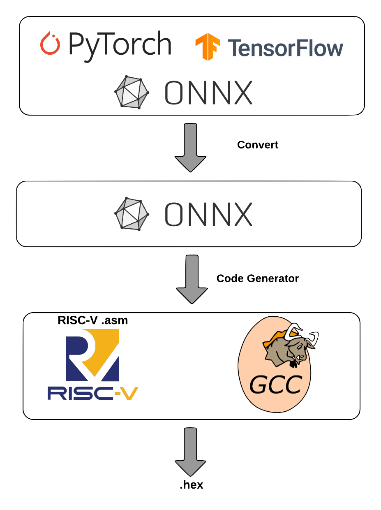

Software Stack
===============

As mentioned earlier, PITO is in compliant with RV32I RISC-V ISA. Hence, all the toolchains developed for RV32I can be used. However, there is a huge gap for running a highlevel neural network model described in Pytorch, Tensorflow or ONNX on a Neural Network accelerator such as BARVINN. :numref:`sw_stack` shows how we try to close this gap. 

  Software stack used in BARVINN. 

Code Generator
-----------------

