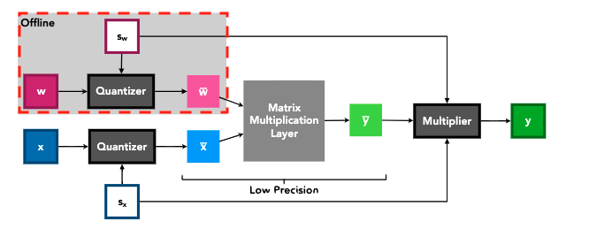

Software Stack
===============

As mentioned earlier, PITO is compliant with RV32I RISC-V ISA. Hence, all the toolchains developed for RV32I can be used. However, there is still a huge gap for running a high-level neural network model described in Pytorch, Tensorflow, or ONNX on a Neural Network accelerator such as BARVINN. :numref:`sw_stack` shows how we try to close this gap. 

.. figure:: _static/sw_stack.png
  :width: 400
  :alt: Alternative text
  :name: sw_stack
  :align: center

  Software stack used in BARVINN. 

Given a model trained in Pytorch, Tensorflow or any other machine learning framework, we first need to convert it to an ONNX model. ONNX is an open format for representing machine learning models. Using ONNX models allows us to write use a single code generator module for all types of machine learning models described in any machine learning framework. 

Before using the code generator, we should first quantize the model. Currently, model quantization is a hot research topic. The main goal of quantization is to reduce calculation precision while maintaining accuracy. Quantization can be applied to a model after or while training. Quantization after training (post-training quantization) can be done statically or dynamically. In post-training static quantization, weights are quantized ahead of time and during a calibration process on the validation set, a scale and bias is computed for the activations. 

In post-training dynamic quantization, much like post-training static quantization, the weights are quantized ahead of time but the activations are dynamically quantized at inference. Dynamic quantization is useful for models where model execution time is dominated by the time it takes to load weights for the model e.g LSTM. 

Quantization can also be learned by the network. In quantization-aware training, the quantization parameters are learned while other parameters in the network are learned. 

There are many quantization methods proposed in the literature. However, although they are very different in training, at inference, these methods usually use a scaling factor and clip function to quantize the value. As an example, in Learned Step Size Quantization SK Esser, et.al (2020), the authors provided the following :numref:`lsq` computational graph:

  Low precision computation in LSQ, this image was taken from LSQ paper SK Esser, et.al (2020).

As it can be seen, at training time, `S_w` and `S_x` are used to first quantize both activation and weights. These quantized values are fed into a low precision matrix multiply block. Finally, `S_w` and `S_x` are used to rescale the result. However, at inference time, the weight quantization can be performed offline and only activation quantization is necessary. In BARVINN, we added support for such quantization methods. There are scaling factor rams in each MVU that can be programmed to hold the scaling factor.

.. warning::
    Currently, we only support plain CNN models without any residual connections. You can refer to "Residual Distillation: Towards Portable Deep Neural Networks without Shortcuts" NeurIPS 2020 paper to learn how to train a resnet-like model and convert it into a plain CNN model.

Code Generator
-----------------

Once model training and quantization are done, we can export the model to ONNX format. We have provided a python library to take the ONNX model and generate MVU configuration code. There are two components to map an ONNX model to configuration code for MVU. We first need to parse an ONNX model and depending on the operation, break it down into matrix multiply operations. Then we need to generate configuration code for each matrix multiply. Since MVU expects the weights to be in the transposed MSB first format, we then need to reformat the weights. In BARVINN, we have provided a python library to help users map their ONNX model into a format that can be used to be executed on BARVINN. One then can use the following code to map and ONNX model into configuration code:

.. code:: python

    1 import logging
    2 import argparse
    3 from OnnxParser import OnnxParser
    4 from Generator import Generator
    5 import utils
    6 
    7 def parse_args():
    8     parser = argparse.ArgumentParser()
    9     parser.add_argument('-x', '--onnx_model', help='input onnx model', required=True)
   10     parser.add_argument('--aprec', help='Activation precision', required=False, default=8, type=int)
   11     parser.add_argument('--wprec', help='Weight precision', required=False, default=8, type=int)
   12     parser.add_argument('--oprec', help='Output precision', required=False, default=8, type=int)
   13     parser.add_argument('--input_shape', help='input shape for ',  nargs='*', required=False, default=[3,32,32], type=int)
   14     args = parser.parse_args()
   15     return vars(args)
   16 
   17 if __name__ == '__main__':
   18     args = parse_args()
   19     model_path = args['onnx_model']
   20     precision = [args['aprec'], args['wprec'], args['oprec']]
   21     input_shape = args['input_shape']
   22     model = OnnxParser(model_path)
   23 
   24     # model.print_onnx_graph()
   25     # model.print_onnx_model()
   26     if len(args['input_shape'])>3:
   27         print("Expecting an input array of shape: [channels, height, lenghth]")
   28         import sys
   29         sys.exit()
   30     generator = Generator(model, precision, input_shape)
   31     generator.generate_mvu_configs()
   32     generator.export_weigths()
   33     utils.gen_test_vecs(model_path, precision, input_shape)

As an example, we have used the quantized `distilled_resnet18.onnx` (available in BARVINN repo) with the sample code above to generate MVU configuration code. The following is the output of the code generator:

.. code:: bash

    Generated MVU configuration:
    +-------------+-----------+-------------------+------------------------+------------------+------------------------+-----------+-----------------------+
    | iShape      | fShape    | ilength           | ijump                  | wlength          | wjump                  | countdown | total layer countdown |
    +-------------+-----------+-------------------+------------------------+------------------+------------------------+-----------+-----------------------+
    | [1, 32, 32] | [1, 3, 3] | [0, 3, 2, 2, 0]   | [-132, -132, 60, 2, 0] | [0, 0, 3, 8, 0]  | [-16, 2, -16, 2, 0]    | 1080      | 36720                 |
    +-------------+-----------+-------------------+------------------------+------------------+------------------------+-----------+-----------------------+
    | [1, 32, 32] | [1, 3, 3] | [0, 3, 2, 2, 0]   | [-132, -132, 60, 2, 0] | [0, 0, 3, 8, 0]  | [-16, 2, -16, 2, 0]    | 1080      | 36720                 |
    +-------------+-----------+-------------------+------------------------+------------------+------------------------+-----------+-----------------------+
    | [1, 32, 32] | [1, 3, 3] | [0, 3, 2, 2, 0]   | [-132, -132, 60, 2, 0] | [0, 0, 3, 8, 0]  | [-16, 2, -16, 2, 0]    | 1080      | 36720                 |
    +-------------+-----------+-------------------+------------------------+------------------+------------------------+-----------+-----------------------+
    | [1, 32, 32] | [1, 3, 3] | [0, 3, 2, 2, 0]   | [-132, -132, 60, 2, 0] | [0, 0, 3, 8, 0]  | [-16, 2, -16, 2, 0]    | 1080      | 36720                 |
    +-------------+-----------+-------------------+------------------------+------------------+------------------------+-----------+-----------------------+
    | [1, 32, 32] | [1, 3, 3] | [0, 3, 2, 2, 0]   | [-132, -132, 60, 2, 0] | [0, 0, 3, 8, 0]  | [-16, 2, -16, 2, 0]    | 1080      | 36720                 |
    +-------------+-----------+-------------------+------------------------+------------------+------------------------+-----------+-----------------------+
    | [1, 32, 32] | [2, 3, 3] | [0, 7, 2, 2, 0]   | [-130, -132, 60, 2, 0] | [0, 1, 3, 8, 0]  | [-34, 2, -16, 2, 0]    | 1080      | 18360                 |
    +-------------+-----------+-------------------+------------------------+------------------+------------------------+-----------+-----------------------+
    | [2, 16, 16] | [2, 3, 3] | [0, 7, 2, 5, 0]   | [-134, -138, 54, 2, 0] | [0, 1, 3, 17, 0] | [-70, 2, -34, 2, 0]    | 2016      | 36288                 |
    +-------------+-----------+-------------------+------------------------+------------------+------------------------+-----------+-----------------------+
    | [2, 16, 16] | [2, 3, 3] | [0, 7, 2, 5, 0]   | [-134, -138, 54, 2, 0] | [0, 1, 3, 17, 0] | [-70, 2, -34, 2, 0]    | 2016      | 36288                 |
    +-------------+-----------+-------------------+------------------------+------------------+------------------------+-----------+-----------------------+
    | [2, 16, 16] | [2, 3, 3] | [0, 7, 2, 5, 0]   | [-134, -138, 54, 2, 0] | [0, 1, 3, 17, 0] | [-70, 2, -34, 2, 0]    | 2016      | 36288                 |
    +-------------+-----------+-------------------+------------------------+------------------+------------------------+-----------+-----------------------+
    | [2, 16, 16] | [4, 3, 3] | [0, 15, 2, 5, 0]  | [-130, -138, 54, 2, 0] | [0, 3, 3, 17, 0] | [-142, 2, -34, 2, 0]   | 2016      | 18144                 |
    +-------------+-----------+-------------------+------------------------+------------------+------------------------+-----------+-----------------------+
    | [4, 8, 8]   | [4, 3, 3] | [0, 15, 2, 11, 0] | [-138, -150, 42, 2, 0] | [0, 3, 3, 35, 0] | [-286, 2, -70, 2, 0]   | 3456      | 34560                 |
    +-------------+-----------+-------------------+------------------------+------------------+------------------------+-----------+-----------------------+
    | [4, 8, 8]   | [4, 3, 3] | [0, 15, 2, 11, 0] | [-138, -150, 42, 2, 0] | [0, 3, 3, 35, 0] | [-286, 2, -70, 2, 0]   | 3456      | 34560                 |
    +-------------+-----------+-------------------+------------------------+------------------+------------------------+-----------+-----------------------+
    | [4, 8, 8]   | [4, 3, 3] | [0, 15, 2, 11, 0] | [-138, -150, 42, 2, 0] | [0, 3, 3, 35, 0] | [-286, 2, -70, 2, 0]   | 3456      | 34560                 |
    +-------------+-----------+-------------------+------------------------+------------------+------------------------+-----------+-----------------------+
    | [4, 8, 8]   | [8, 3, 3] | [0, 31, 2, 11, 0] | [-130, -150, 42, 2, 0] | [0, 7, 3, 35, 0] | [-574, 2, -70, 2, 0]   | 3456      | 17280                 |
    +-------------+-----------+-------------------+------------------------+------------------+------------------------+-----------+-----------------------+
    | [8, 4, 4]   | [8, 3, 3] | [0, 31, 2, 23, 0] | [-146, -174, 18, 2, 0] | [0, 7, 3, 71, 0] | [-1150, 2, -142, 2, 0] | 4608      | 27648                 |
    +-------------+-----------+-------------------+------------------------+------------------+------------------------+-----------+-----------------------+
    | [8, 4, 4]   | [8, 3, 3] | [0, 31, 2, 23, 0] | [-146, -174, 18, 2, 0] | [0, 7, 3, 71, 0] | [-1150, 2, -142, 2, 0] | 4608      | 27648                 |
    +-------------+-----------+-------------------+------------------------+------------------+------------------------+-----------+-----------------------+
    | [8, 4, 4]   | [8, 3, 3] | [0, 31, 2, 23, 0] | [-146, -174, 18, 2, 0] | [0, 7, 3, 71, 0] | [-1150, 2, -142, 2, 0] | 4608      | 27648                 |
    +-------------+-----------+-------------------+------------------------+------------------+------------------------+-----------+-----------------------+
    Total countdown: 532872
    Exporting conv1.0.weight to conv1.0.weight.hex
    Exporting conv2_x.0.residual_function.0.weight to conv2_x.0.residual_function.0.weight.hex
    Exporting conv2_x.0.residual_function.3.weight to conv2_x.0.residual_function.3.weight.hex
    Exporting conv2_x.1.residual_function.0.weight to conv2_x.1.residual_function.0.weight.hex
    Exporting conv2_x.1.residual_function.3.weight to conv2_x.1.residual_function.3.weight.hex
    Exporting conv3_x.0.residual_function.0.weight to conv3_x.0.residual_function.0.weight.hex
    Exporting conv3_x.0.residual_function.3.weight to conv3_x.0.residual_function.3.weight.hex
    Exporting conv3_x.1.residual_function.0.weight to conv3_x.1.residual_function.0.weight.hex
    Exporting conv3_x.1.residual_function.3.weight to conv3_x.1.residual_function.3.weight.hex
    Exporting conv4_x.0.residual_function.0.weight to conv4_x.0.residual_function.0.weight.hex
    Exporting conv4_x.0.residual_function.3.weight to conv4_x.0.residual_function.3.weight.hex
    Exporting conv4_x.1.residual_function.0.weight to conv4_x.1.residual_function.0.weight.hex
    Exporting conv4_x.1.residual_function.3.weight to conv4_x.1.residual_function.3.weight.hex
    Exporting conv5_x.0.residual_function.0.weight to conv5_x.0.residual_function.0.weight.hex
    Exporting conv5_x.0.residual_function.3.weight to conv5_x.0.residual_function.3.weight.hex
    Exporting conv5_x.1.residual_function.0.weight to conv5_x.1.residual_function.0.weight.hex
    Exporting conv5_x.1.residual_function.3.weight to conv5_x.1.residual_function.3.weight.hex
    Inference finised in 0.0082 seconds
    Exporting output to output.hex
    Exporting input to input.hex

As you can see, the code generator provides a configuration for each layer of the input model. These values can be directly used in C/assembly code to program the MVU. The code generator also generates a weight hex file for each layer that can be used by the simulator to program the MVU rams. Finally, the code generator used the input ONNX model with OnnxRuntime engine to generate and expected results given a random input vector, both of which are also saved the generator code so that they can be used for verification purposes.
