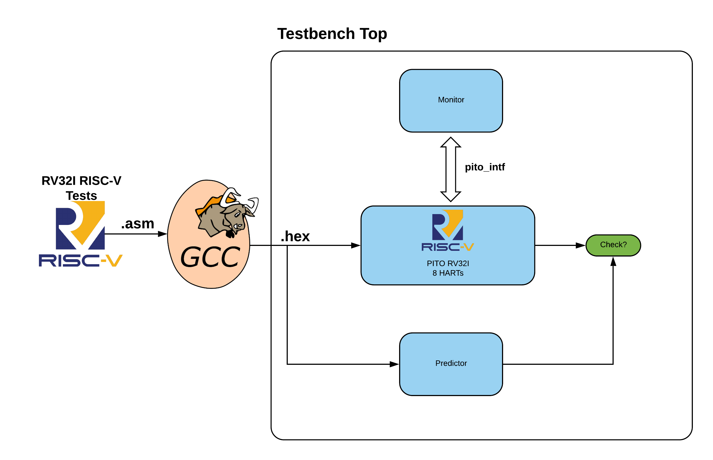
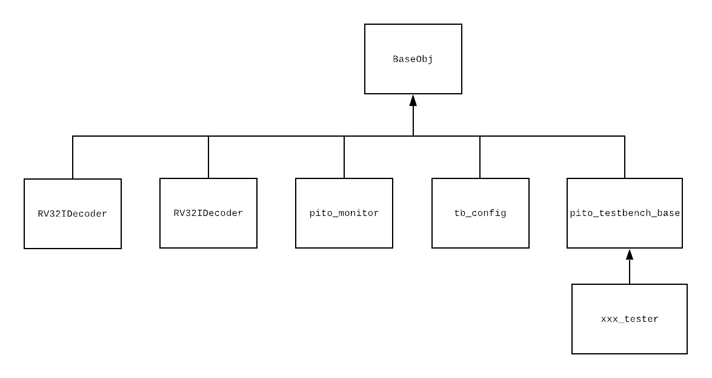

Verification
============

To verify the functionality of our design, we have created a verification environement. We used Viavdos support for Systemverilog. Although UVM verificaiton was a much better choice to start with, however, when we started the project, there were no support for UVM in Vivado. Currently, Vivado 2020 supports UVM based verification but our verification is still based on a simple class based verification. In the following sections, we provide an overview of what has been implmented. Also, we will review how new tests can bee added and how to run simulations.

Verification Environement
--------------------------

:numref:`verif_env` illustrates the overall architecture of our verification environment. For simplicity, we will review the verification environment in PITO. However, both MVU and BARVINN follow the same verification structure. 
There are four main verification components in our verification design:

- Testbench Monitor
- Testbench Predictor
- Testbench Base
- Testbench Top

  Verification Environment for PITO, showcasing how RISC-V tests are verified in our design.

Testbench Monitor
------------------

In our design, a `Testbench Monitor` is a testbench module that monitors transactions inside the DUT. In PITO the `Testbench Monitor` module is named `pito_monitor`. An important task of `pito_monitor` is to sync with the DUT. This is a crucial step since our predictor module and DUT must be in the exact same state to allow the predictor module correctly predict the next state. `pito_monitor` syncs to DUT by checking if the first instruction in the firmware is correctly excuted by the DUT. Once the monitor found such an instruction, it will move to the sync state. Otherwise, it will wait for a pre-determined wait period `NUM_WAIT_CYCELS` until it timesout and halts the simulation. 

Once the sync period is done, `pito_monitor` samples data for the predictor module. In PITO verification environment, `pito_monitor` class instantiates a `RV32IPredictor` module and uses hdl path and `pito_interface` to monitor transactions within the DUT. On every clock cycle, `pito_monitor` samples the DUT's CSR, register file and memory as well as the executed instruction. It then passes all these samples to the `RV32IPredictor` module. 

Testbench Predictor
--------------------

A testbench predictor module is responsible to predict the state of each hardware block in the DUT. There are many industry proven predictors. As an example, `Spike  <https://github.com/riscv/riscv-isa-sim>`_ is a RISC-V simulator that provides functional model for different RISC-V ISA. It can also be integrated with Systemverilog through SyetemVerilog DPI. However, we decided to write our own functional model of PITO since Spike does not support a Barrel design. As an example, in PITO, there is no logic to prevent data or control hazard. On the other hand, although Spike supports multiple harts, but a normal data path with data and control hazard has been implemented. Hence, Spike in its default format is unable to correctly predict the DUT behaviour.

`RV32IPredictor` module is a functional model of PITO written in SystemVerilog. It supports all base RV32I instructions. For every intruction that is executed in the DUT, our predictor can predict the expected results. `RV32IPredictor` is designed to support as many harts as it is required. It also contains the base RISC-V CSRs plus the custom CSRs that we added for configuring the MVU. 

The `RV32IPredictor` module has no direct connection to the DUT. All the transactions are sampled by the monitor module and then they are provided to the predictor module. Hence, as mentioned before, it is crucial for the monitor module to sync correctly with the DUT. Once the predictor module receives a sample from monitor, it will process the instruction and it will update the `test_stat` variable to be used by the testbench.

Testbench Base
---------------

Testbench base is a SystemVerilog class that contains testbench predictor and testbench monitor class. Figure :numref:`classbased_verif` illustrates the class structure for our verification environment. As it can be seen, testbench base class (`pito_testbench_base` in PITO verification environment) should be used as base class for all other test classes. Each test has thress phases, testbench setup phase, testbench run phase and testbench report phase. All these phases are virtual tasks that allows the user to override them.

  Class structure of PITO verification

In testbench setup phase, we usually put the DUT into reset mode and we will provide reset configurations. At this stage, we should load any firmware into the instruction ram and load data ram with the data generated by the compiler. We should also initialize the register files and prepare the start sequence for the processor. However, this can overwritten by the test in case there are other things need to be added. In testbench run phase we usually run the firmware on the DUT. However, before that, we should kick start the monitor to sync with the DUT. Finally, in the report phase, we report the result of the test. The testbench base class has a `test_stat` variable that is passed to the monitor class. In the report phase, we will use this data structure to report the result of the test.

Testbench Top
--------------

Unlike the previous testbench components, testbench top is a SystemVerilog module. As it can be seen in :numref:`verif_env`, testbench top module instantiate all the other components (DUT, tests, interface). It also connects the DUT to the testbench through the interface. Another important task of this module is to call the three phase of the testbench that was described earlier. The testbench top module also provides the clock signal for the entire system. 

Running a Test in PITO Verification Environment
------------------------------------------------

Our design supports `FuseSoC <https://github.com/olofk/fusesoc>`_. In order to run any of the tests provided, you will first need to make make sure that the Vivado is available in thesystem. We are currently support Vivado 2019.1:

.. code:: bash

    source /opt/Xilinx/Vivado/2019.1/settings64.sh

Then, make sure you have fusesoc installed:

.. code:: bash

    python3 -m pip install fusesoc

Then add pito to your fusesoc libraries:

.. code:: bash

    git clone https://github.com/hossein1387/pito_riscv.git
    cd pito_riscv
    fusesoc library add pito .

Then run simulation (No GUI):

.. code:: bash

    fusesoc run --target=sim pito

For synthesis:

.. code:: bash

    fusesoc run --target=synth pito

To open sim in GUI mode:

.. code:: bash

    cd build/pito_0/sim-vivado/ 
    make run-gui

And for synthesis:

.. code:: bash

    cd build/pito_0/synth-vivado/ 
    make build-gui

This should open the project for you. Make sure you have run simulation or synthesis atleast once, otherwise fusesoc would not create a project file for you.